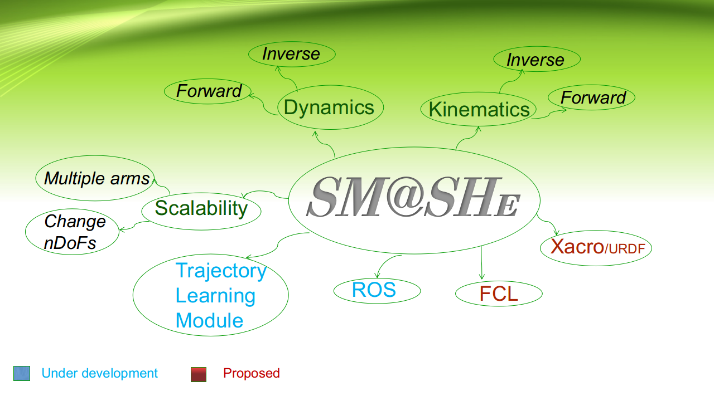

# Spacecraft Manipulator Arm Simulation Hybrid Engine 
## SM@SHe

SM@SHe is a Python library for the autonomous trajectory learning and control of free-floating space manipulator arms intended for the purpose of debris removal, on-orbit servicing, rendezvous & docking etc. 
The capabilities of SM@SHe can be summarized as shown in figure.
<!-- 
*Capabilities of SM@SHe* -->

      
      *Capabilities of SM@SHe*

      
      *Model Predictive Control of 9-DOF spacecraft-arm*

**References**
1.  Y. Umetani, K Yoshida, "[Resolved Motion Rate Control of Space Manipulators with Generalized Jacobian Matrix](https://www.researchgate.net/profile/Kazuya_Yoshida3/publication/3298017_Resolved_Motion_Rate_Control_of_Space_Manipulators_with_Generalized_Jacobian_Matrix/links/564f714d08ae1ef9296e9ea8/Resolved-Motion-Rate-Control-of-Space-Manipulators-with-Generalized-Jacobian-Matrix.pdf)", IEEE Trans. on Robotics and Automation, vol. 5, no. 3, pp. 303-314, 1989.
2. Markus Wilde, Stephen Kwok Choon, Alessio Grompone and Marcello Romano, "[Equations of Motion of Free-Floating Spacecraft-Manipulator Systems: An Engineer’s Tutorial](https://www.frontiersin.org/articles/10.3389/frobt.2018.00041/full)", Frontiers in Robotics & AI, 2018
3. EG Papadopoulos [On the dynamics and control of space manipulators](https://scholar.google.com/scholar?hl=en&as_sdt=0%2C5&q=on+the+dynamics+and+control+of+space+manipulators&btnG=), 1990
